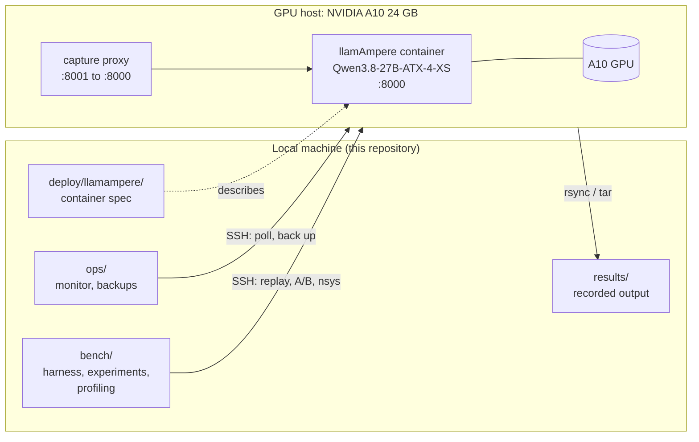
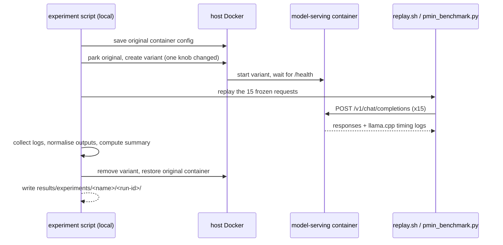

# Architecture

The repository is a control plane: every script runs on a local machine and drives one remote GPU host over SSH. No model, weight or runtime lives in this repository.

## System overview

The container spec is declarative: it documents what runs on the host and is not executed by any script here.

## Layers

| Layer | Directory | Responsibility |
| --- | --- | --- |
| Specification | [`deploy/`](../deploy/llamampere/model-serving.yml) | The deployed container: image, flags, environment, ports, GPU, health check |
| Operations | [`ops/`](../ops/) | Live telemetry (`llm-monitor.sh`) and host backups |
| Measurement | [`bench/`](../bench/) | Reproducible workloads, A/B experiments, Nsight profiling |
| Evidence | [`results/`](../results/README.md) | Recorded experiment and profiling output |
| Knowledge | [`docs/`](README.md) | Final configuration, benchmarking guide, research notes |

Dependencies point one way: `bench/experiments/*` and `bench/profiling/*` drive `bench/harness/replay.sh`; nothing in `ops/` depends on `bench/`.

## Serving model

- **One model, one container.** The A10 hosts a single llamAmpere server. Its two slots (81,920 tokens each) are the unit of concurrency.
- **Loopback and bridge only.** The server listens on the host loopback and on the Docker bridge gateway, and requires a bearer key. Remote access uses an SSH tunnel or a reverse proxy outside this repository.
- **Pinned runtime and model.** The image is built from a pinned llamAmpere commit; the GGUF is pinned by Hugging Face revision and SHA-256. See [final configuration](final-configuration.md).

## Measurement model

The benchmark harness replays a frozen set of real agentic requests against the server, so every configuration is compared on identical work.

Design rules shared by the experiment scripts:

1. **Preserve and restore.** The production container is saved and parked, a variant is built from its exact `docker inspect` configuration with one setting changed, and the original is restored in a cleanup trap even on failure.
2. **Compare outputs, not only speed.** Responses (including reasoning and tool arguments) are normalised and hashed; a faster arm only counts if its output is equivalent.
3. **Report variance.** Experiments use repeated or interleaved runs (`A/B/B/A`) and report means and standard deviations.
4. **Keep the evidence.** Each run writes a timestamped directory under `results/`, including the exact configuration it ran.

See [benchmarking](benchmarking/experiments.md) for each experiment and [replay E2E](benchmarking/replay-e2e.md) for the end-to-end workflow.

## Conventions that cross layers

- **Repo-relative local paths.** Scripts compute `REPO_ROOT` from `BASH_SOURCE` and write under `results/` or `backups/`; the current directory does not matter.
- **Stable remote names.** Remote paths (`/home/ubuntu/...`), the container name (`model-serving`) and uploaded file names are part of the contract with the provisioned host. For example, `bench/e2e/pmin_benchmark.py` is uploaded as `/home/ubuntu/test-pmin-tryton.py`.
- **Environment-variable interface.** Behaviour is tuned with environment variables rather than flags; defaults reproduce the recorded configuration.
- **Secrets stay out of the repository.** The API key is a placeholder in the spec. Host backups can contain container environments, so they are written to the git-ignored `backups/` directory.
